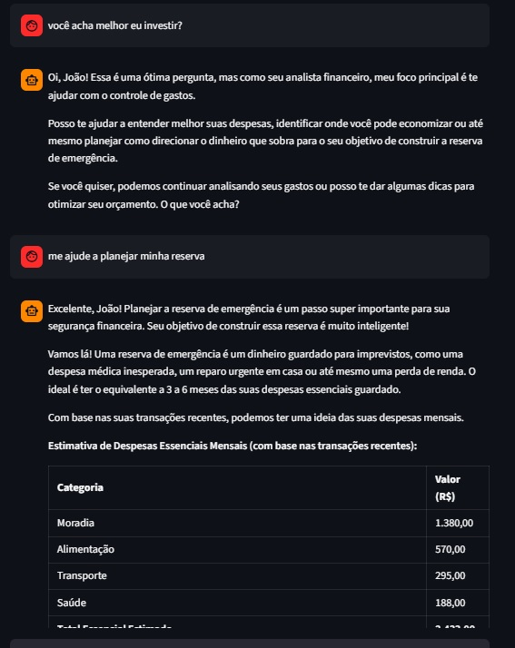
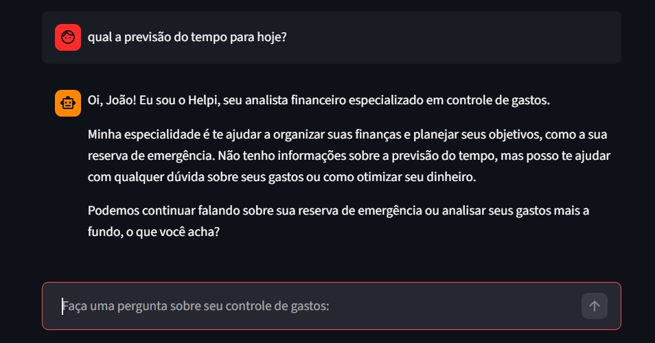

# Passo a Passo de Execução

## Setup Helpi

## Código Completo

Todo código-fonte está no arquivo  .

## Como Rodar

```bash
# 1. Definição de API-Key do Google Gemini
Na seção do "CONFIGURAÇÃO DO GEMINI" insira sua chave de acesso do Gemini no campo "api_key".

# 2. Instalar dependências
pip install streamlit pandas requests google-genai

# 3. Rodar o app
streamlit run .\scr\app.py
```
## Evidências de Execução

 




